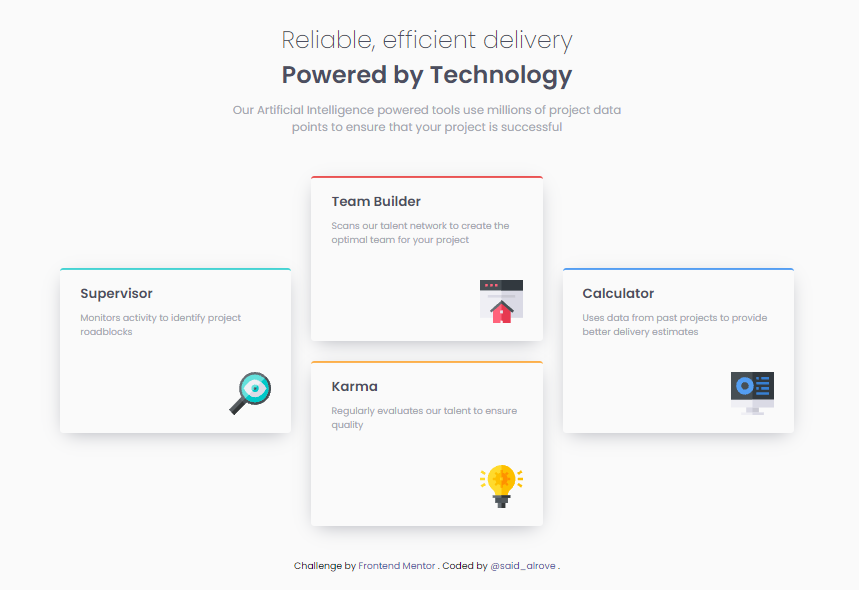

# Frontend Mentor - Four card feature solution

This is a solution to the [Four card feature](https://www.frontendmentor.io/challenges/four-card-feature-section-weK1eFYK/hub/fourcard-feature-with-a-cool-animation-sasssmacss-xYLyDShvs). Frontend Mentor challenges help you improve your coding skills by building realistic projects. 

## Screenshot

## Links

- [Frontend Mentor](https://www.frontendmentor.io/solutions/fourcard-feature-with-a-cool-animation-sasssmacss-xYLyDShvs)
- [Github Live](https://said-alrove.github.io/four-card-feature-sass/)

## Author

- Frontend Mentor - [@said-alrove](https://www.frontendmentor.io/profile/said-alrove)
- Twitter - [@said_alrove](https://twitter.com/said_alrove)
